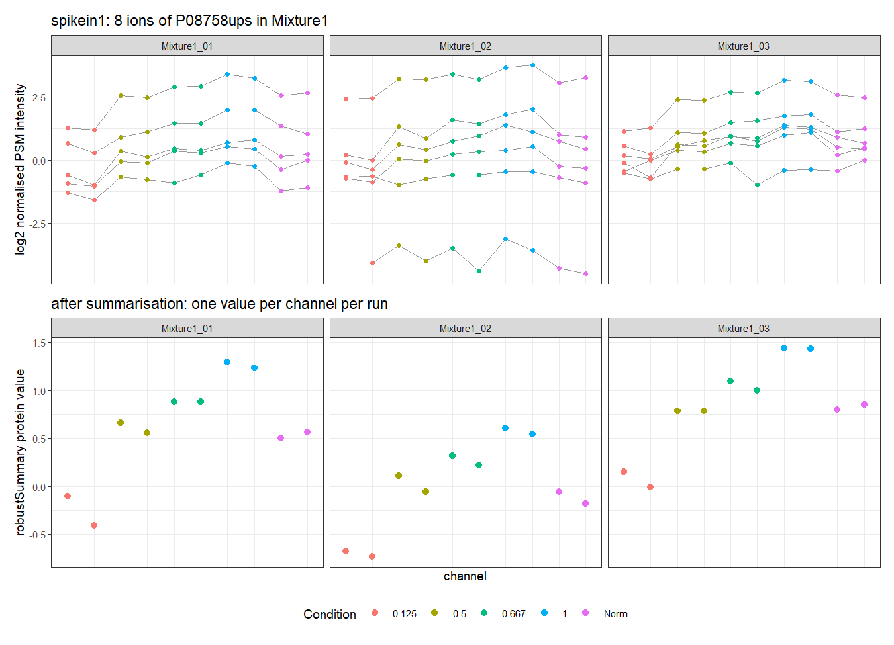
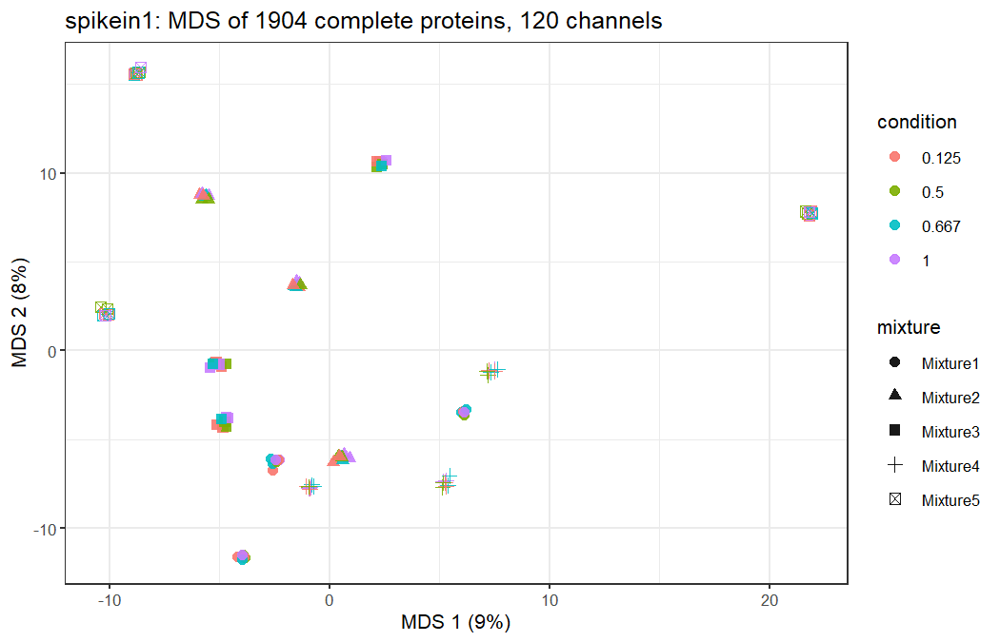
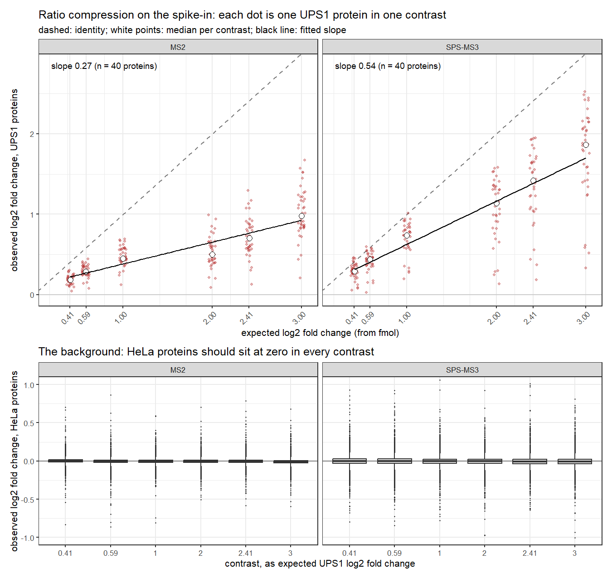
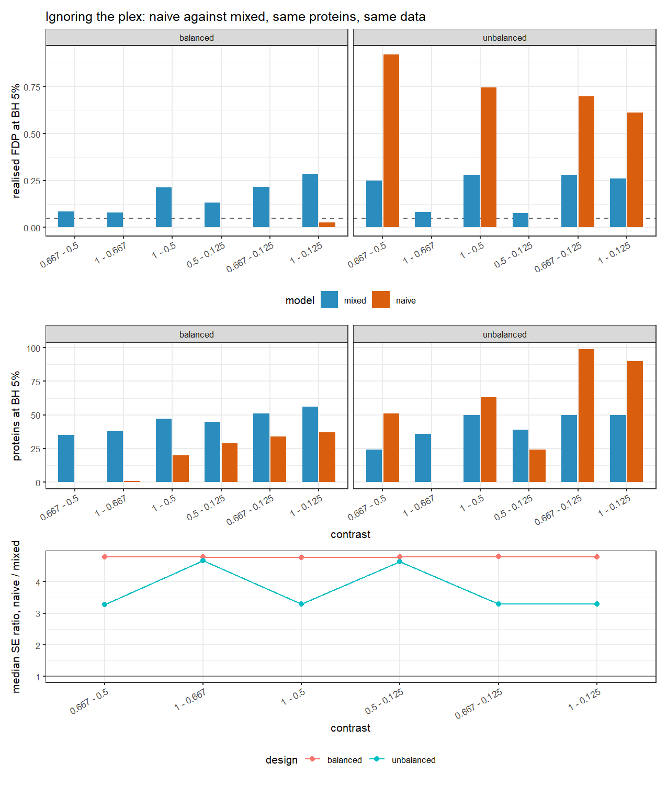
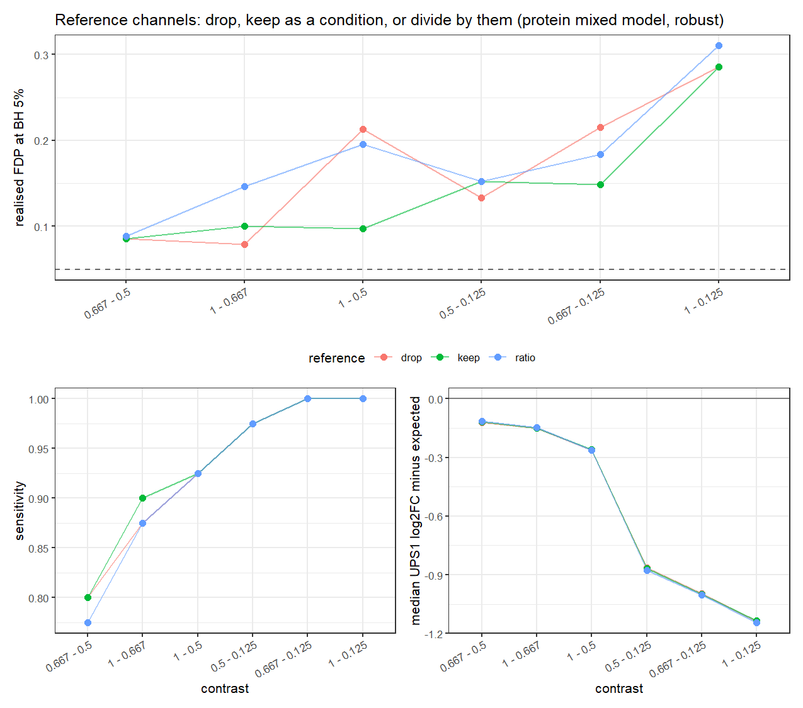
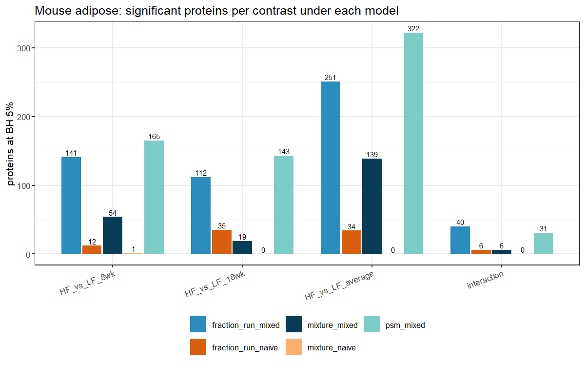
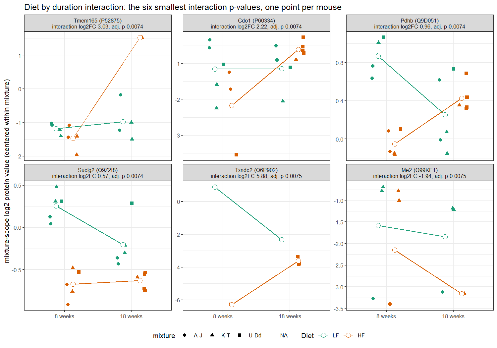
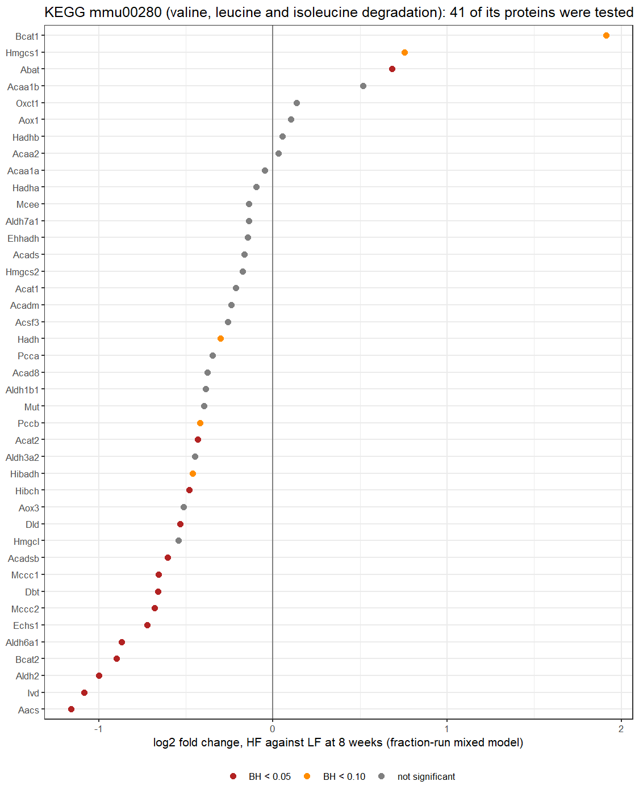
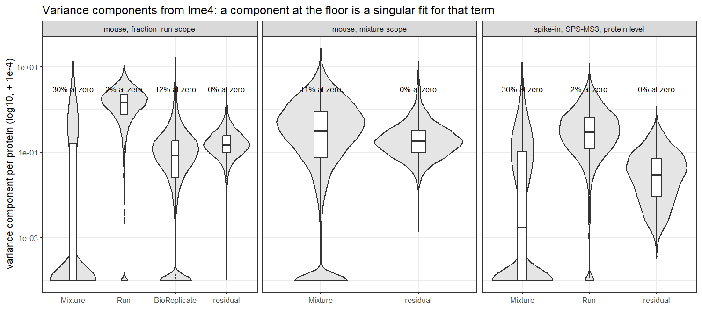

# Ignoring the plex in TMT proteomics mis-ranks proteins in both directions, and the spike-in truth says which

## Summary

Differential abundance in TMT-labelled proteomics was analysed with msqrob2 mixed models on three published Proteome Discoverer PSM tables: the MSstatsTMT controlled mixtures at SPS-MS3 and at MS2 (48 UPS1 proteins spiked at four amounts into SILAC HeLa, five 10-plex mixtures, technical triplicates, 15 runs each) and the Plubell et al. mouse epididymal adipose study (20 mice in a diet by duration factorial, three 10-plex mixtures, nine fractions each, 27 runs). Against the design's known ratios, SPS-MS3 recovered 0.54 log2 units per expected log2 unit and MS2 recovered 0.27; scan by scan, the MS2 fold change fell from 1.16 to 0.71 log2 units as isolation interference rose from under 10 to over 50 per cent, against an expected 3.00. On the balanced spike-in the naive fixed-effects model, which treats 120 channel measurements as 120 samples, was conservative rather than liberal: it called nothing on the 1.33-fold contrast, where the mixed model with run and mixture random effects called 32 of 40 UPS1 proteins, and its one false call in six contrasts was against 49 for the mixed model. On a defined unbalanced subset of the same channels, where conditions are only partly shared between mixtures, the naive model's realised false discovery proportion on the four across-mixture contrasts was 61 to 92 per cent at a nominal 5, and the mixed model's on the same channels was 25 to 28. In the mouse data, which is unbalanced by design, the mixed model called 141 proteins between diets at 8 weeks, 112 at 18 weeks and 40 for the interaction at 5 per cent FDR; the naive model called 12, 35 and 6, and 30 of its 35 calls at 18 weeks were proteins the mixed model, which weights animals rather than fraction values, did not call. Branched chain amino acid catabolism was lower on high fat at 8 weeks in 33 of the 41 KEGG pathway members tested, 19 of them significant at 10 per cent FDR against 219 of 3,903 other proteins (Fisher p = 2.5e-13), which agrees with the direction Plubell et al. reported.

## Background

A tandem mass tag is a chemical label with a reporter group, a balancer group and an amine-reactive group. Every sample in a plex gets a label of the same total mass whose reporter differs by a few isotopes, so the labelled peptides from all samples co-elute and co-isolate as one precursor, and only on fragmentation do the reporter ions separate at distinct masses between 126 and 131 for a 10-plex. The reporter ion intensity for one channel of one scan is the quantification of that peptide in that sample. That is the whole trade: one identification event serves ten samples.

Label-free quantification, the subject of the two earlier repositories, pays for each sample separately. Each run is its own data-dependent acquisition, the instrument picks precursors afresh, and a peptide quantified in seven of nine runs is missing in two because it was never selected there. Multiplexing removes that lottery within a plex: if the precursor was selected, all ten channels are measured in the same scan. It charges for it in three ways that the label-free pipelines never met.

The first is co-isolation. The isolation window around a precursor admits whatever else elutes at that mass, and every co-isolated peptide contributes its own reporter ions to the same scan. Those contaminating reporter ions come from the whole sample, so they sit near a 1:1:1 ratio across channels, and they dilute any real difference toward unity. This is ratio compression, and it is the reason Ting, Rad, Gygi and Haas isolated MS2 fragments for a third stage of mass spectrometry (Nature Methods 2011): the fragment ions of the target peptide carry its reporters, the co-isolated precursors' fragments mostly do not. Proteome Discoverer writes the fraction of the isolation window that was not the precursor into every PSM row as "Isolation Interference", and this repository uses that column to show the mechanism scan by scan.

The second is that a plex is a batch you built on purpose. All ten samples of a mixture were labelled with one kit lot, pooled in one tube, cleaned up together and acquired in the same runs. Every channel of a mixture shares that history and no channel of another mixture does. Readers of RNA-seq will recognise the structure: a mixture is a library preparation batch, except that here it is a hard boundary, because a channel cannot exist outside its plex. When an experiment needs more samples than one plex holds, the design is several batches with the treatment spread across them, and the between-mixture variance has to be modelled or it lands in the residuals or, worse, in the treatment estimate.

The third is that the channels of one scan are not independent measurements. They were integrated from the same MS3 (or MS2) spectrum, under one automatic gain control fill, one injection time and one co-isolation background. Their errors are correlated by construction. In a label-free experiment, the nine technical injections in the stage 1 repository were at least nine independently acquired measurements, which is why treating them as replicates inflated the effective sample size but left the point estimates roughly honest. In TMT the pseudo-replication is deeper: a technical rerun of a mixture re-measures the same tube, and within a run the channels re-use the same scans.

Missingness changes with it. Within an acquired scan, every channel gets a value, so a peptide is either quantified for all ten samples of a run or, when its precursor was never selected in that injection, missing for all ten at once. Missingness moves from the sample level to the run level, and the between-sample informative missingness of label-free data, where low abundance in one sample is the likely reason a peptide is absent there, becomes a between-run story that depends on the identification lottery, not on the sample. The channel-level zeros that remain are rare in the spike-in: after filtering, 0.6 to 0.9 per cent of reporter values in the SPS-MS3 runs and under 0.2 per cent in the MS2 runs are missing (`results/*_missingness.tsv`). The mouse runs are at 3 to 15 per cent.

## Data

Two datasets, three PSM tables, all from Proteome Discoverer 2.2.0.388 and Mascot, none searched here. The spike-in tables are the ones the msqrob2TMT authors timestamped on Zenodo (record 14767905, revision 8, CC BY 4.0) plus the MS2 counterpart from MassIVE; the mouse table is the Zenodo copy of the MSstatsTMT reanalysis.

| | Spike-in, SPS-MS3 | Spike-in, MS2 | Mouse adipose |
|---|---|---|---|
| Organism | Homo sapiens (SILAC HeLa) plus 48 human UPS1 proteins | same samples | Mus musculus |
| Publication | Huang et al. 2020, MCP 19(10):1706-1723 | Huang et al. 2020 | Plubell et al. 2017, MCP 16(5):873-890 |
| Accession | MSV000084264, PXD015258 | MSV000084266, PXD015261 | MSV000082569, PXD005953 |
| Reanalysis container | RMSV000000265 | none used | RMSV000000264 |
| Design | 500, 333, 250, 62.5 fmol UPS1 in 50 ug HeLa, each in duplicate, plus two pooled references, per mixture | same | 5 mice per diet by duration cell, 2 pooled references per mixture, 4 aged mice outside the factorial |
| Instrument | Orbitrap Fusion Lumos, EASY-nLC 1200, 270 min gradient, SPS with 10 notches, MS3 in the Orbitrap at 60k | same instrument, MS2-only HCD at NCE 40 | Orbitrap Fusion, SPS-MS3 |
| Search | Mascot 2.6.1, two passes: SwissProt human 07.2018 with SILAC and TMT static modifications, then UPS sequences without SILAC; Percolator q < 0.01 | same | Mascot 2.6.2, SwissProt mouse 07.2017, TMT static |
| Plex | TMT 10-plex | TMT 10-plex | TMT 10-plex |
| Mixtures | 5 | 5 | 3 |
| Runs | 15 (technical triplicates) | 15 | 27 (nine high-pH fractions per mixture) |
| PSM rows in the export | 317,943 | 399,295 | 111,744 |
| Protein accessions in the export | 5,903 | 6,767 | 5,823 |
| Table size | 238.8 MB | 301.4 MB | 80.9 MB |

The instrument and search details come from the supplementary information of Huang et al. 2020 and from the Plubell methods, not from memory. The protein counts match the numbers Huang et al. reported for their exports (5,903 for MS3, 6,767 for MS2, 5,823 for the mouse), which is how the tables were confirmed to be the ones the paper describes.

Which spike-in table is which acquisition is not written inside the tables: the "MS Order" column reports the identifying scan, which is MS2 in both. The assignment rests on provenance. The Zenodo file was copied from the reanalysis container of MSV000084264, whose MassIVE title reads "acquired using SPS-MS3" and whose raw files are dated 161117; MSV000084266 is titled "acquired using MS2-only strategy", its raw files are dated 161122, and its export name carries the token MS2. Both are written to `results/spikein1_acquisition.tsv`.

Three source errors were found while resolving this. The msqrob2TMT companion repository and the Huang et al. data availability statement both write the SPS-MS3 accession as PXD0015258, with one digit too many; the MassIVE summary of the MS2 dataset repeats the typo, so it originated with the submission. ProteomeXchange resolves MSV000084264 to PXD015258. The Zenodo record description swaps the two provenance links of the mouse files, so that the PSM filename points at the annotation CSV and the annotation filename at the PSM table; the files themselves are named correctly and the download stage selects by filename from the API listing, then checks that the large one is the PSM table. And the Huang et al. main text says each mouse mixture was separated into eight fractions while its own supplement, the Plubell methods ("raw files from the 9 fractions were merged") and the annotation file say nine. The annotation has 27 runs, nine per mixture, at 14, 20, 22, 24, 26, 28, 30, 40 and 90 per cent acetonitrile; `results/mouse_run_structure.tsv` lists them with their PSM counts.

The download stage enumerates the Zenodo record through its REST API, so filenames, sizes and md5 sums come from the record and not from this repository. One line of the record's description spells a filename "spilein2"; the API listing does not, and the listing is what is trusted. Every file is verified against the record's md5 before anything reads it, and a mismatch stops the run. MassIVE publishes no checksums; the MS2 export's size was checked against the MassIVE listing, which turned out to report the CRLF size on disk while the download endpoint serves LF line endings, a shortfall of exactly 399,296 bytes for 399,296 lines. That is the only size discrepancy the verifier accepts, and only when the shortfall equals the line count. The md5 observed at first retrieval (7e905d38b464087073c5793a40c5ca98) is recorded in `config/external_checksums.tsv` and checked on every later run. All checksums are in `results/data_checksums.tsv`.

The mouse channels are all used. The annotation shows 30 channels assigned, six of them pooled references and four holding the "Long_M" mice, the additional aged animals of the published 24-sample study, which this two by two subset excludes. The imbalance is in how the 20 diet mice fall across the three plexes: the Long_HF cell has 0, 1 and 4 mice in mixtures A-J, K-T and U-Dd, the other three cells have 2, 2 and 1. That distribution is the reason the mixture random effect matters for this dataset and the reason it is poorly estimated.

The msTrawler multibatch tables (O'Brien et al. 2024, spikein2 on the record) are fetched with `--dataset spikein2` and were not analysed for this README.

## Pipeline

Twelve numbered scripts, run in order by `run_all.sh`. Each sources `project.conf`, written by the configure step, and each skips itself when its stamp in `logs/` exists and says so.

**Configure and install.** `00_configure.sh` detects threads, RAM and free disk and writes `project.conf`; the RAM figure the R stages plan against is capped at 4 GB unless `--ram` says otherwise. `01_install.sh` builds a conda environment with R 4.6.1, shellcheck and quarto and then lets BiocManager install the Bioconductor stack inside that R, because bioconda has no Windows builds and mixing conda R packages with BiocManager updates breaks. What it installed is in `config/r_packages.tsv`: Bioconductor 3.23, msqrob2 1.20.0, QFeatures 1.22.0, MsCoreUtils 1.24.0, lme4 2.0-6, limma 3.68.5, data.table 1.18.6.1. Two things did not work on the first attempt and are recorded in the script: conda-forge's r-biocmanager had no build for R 4.6, so BiocManager comes from CRAN inside R; and the conda-forge quarto launcher on Windows did not start, so the RStudio-bundled quarto 1.9.36 is used. Stages never call Rscript directly. They go through `scripts/lib/rscript.sh`, which puts the conda environment's runtime directory on PATH (a conda R on Windows cannot load its C runtime otherwise) or falls through to a system R.

**Download.** Described above. 621 MB in total; a re-run finds everything in the BiocFileCache under `data/.bfc` and verifies it again in a few seconds.

**QFeatures construction.** `03_build_qfeatures.R` reads each PSM table with `fread(check.names = TRUE, integer64 = "double")`, keeps 33 or 34 of the 50 columns (the list and the reason for each is in `results/<dataset>_columns_kept.tsv`), and joins channel to sample through the annotation CSV. A written design table beats parsing the file names: the two spike-in acquisitions carry different dates in their file names for the same design, and nothing in a file name says which channel held which sample. `readQFeatures` builds one assay per run with the ten reporter channels as columns and the run structure preserved.

**Preprocessing.** `04_preprocess.R` applies the filters in the vignette's order and logs each one with its threshold and its reason to `results/<dataset>_filter_log.tsv`. For the SPS-MS3 spike-in:

| step | removed | criterion |
|---|---|---|
| duplicated reporter rows | 11,618 | identical intensity vector within a run |
| ambiguous UPS status | 365 | accession says ups but the Sigma UPS node did not mark it, or the reverse |
| failed protein inference | 7 | empty accession |
| shared peptides | 25,673 | semicolon in the accession |
| rejected by PD consensus | 0 | PSM ambiguity "Rejected" |
| lower-ranked matches | 558 | rank above 1 |
| decoys, contaminants | 0 | none present: the export is post-Percolator at q < 0.01 and no contaminant database was searched |
| ions mapped to different proteins across runs | 0 | |
| proteins seen in a single run | 462 | 1 of 15 runs |
| repeat spectra of one ion in a run | 8,915 | highest summed intensity kept |
| more than half the channels missing | 3,498 | vignette threshold, arbitrary |

The duplicates come from the two Mascot nodes. Every spectrum was searched against SwissProt with the SILAC heavy labels as static modifications and against the Sigma UPS sequences without them; a spectrum matched by both nodes appears twice with byte-identical reporter intensities. Leaving both in would enter one scan's ten reporter ions into two proteins' summaries and double that scan's weight; keeping one at random would assign the scan to a database by coin toss. Both copies go, as the msqrob2TMT paper does. The MS2 table lost 15,149 rows the same way and the mouse table, searched with one node, has none.

Every criterion is a property of the identification or of measurement completeness and can be evaluated without knowing which channel is which condition. That independence from the test statistic is what keeps filtering from biasing the p-value distribution: a filter that looked at fold changes would select proteins that happen to look differential, and the null distribution of the survivors would no longer be uniform.

Zeros become NA, then log2. Normalisation is median centering per channel within each run. The assumption is equal loading. In the spike-in it holds by construction, 50 ug of HeLa per channel with the UPS1 proteins under one per cent of it, and the channel medians within a run differed by a median of 0.09 log2 units before centering (`results/spikein1_normalisation_factors.tsv`). In the mouse data every channel is a different animal and the assumption becomes that a high fat diet does not shift the median adipose protein; the channel medians within a run differed by 0.45 log2 units and by up to 1.04, so normalisation does real work there. Both transformations are applied in place with `replaceAssay`: `logTransform` and `normalize` each add a full copy of every run assay to the object, and the first version of this stage peaked at 5.2 GB. The larger saving came from replacing data.table's grouped `uniqueN()` with `unique()` followed by a count; on the 280,000-row rowData the grouped call allocated over 5 GB by itself. The stage now peaks at 1.4 GB for the SPS-MS3 table and 1.6 GB across all three.

Summarisation is `MsCoreUtils::robustSummary` within each run: for one protein in one run it fits intensity as feature effect plus sample effect by M-estimation and reports the sample effects as the protein's per-channel values, so an outlying PSM is down-weighted rather than averaged in. The paper used median polish. Figure 1 shows what the operation does to one UPS1 protein. For the mouse data a second object summarises within the whole mixture instead, following the paper's mixture script: all PSMs of a protein from the nine fractions of a mixture, one PSM per ion (the highest summed intensity across fractions), one value per channel. After summarisation the spike-in has 4,298 proteins, 40 of them UPS1 (the other 8 fell to the ambiguity, shared-peptide and single-run filters), by 150 channels; the MS2 table has 4,881 proteins, also 40 UPS1; the mouse fraction-run scope has 4,683 proteins by 270 columns, 76 per cent of them missing because a fractionated protein appears in one to three fractions, and the mixture scope has the same proteins by 30 columns with 26 per cent missing.

**Reference channels.** Three treatments, as functions in `scripts/lib/reference_channels.R`, chosen by a flag: drop them and let the run and mixture random effects absorb between-plex shifts (what the paper does); keep them as ordinary observations with their own condition level; or express every channel as a log ratio to the mean of the run's references, feature by feature, and then discard the references (the classical normalisation, MSstatsTMT's reference_norm). The benchmark decides.

**Models.** `msqrob` with lme4-style formulas, robust M-estimation on, ridge off, serial `BiocParallel` by default. Workers copy the QFeatures object, and at 4 GB two copies of a quarter-gigabyte PSM table plus lme4's working memory run out before they win any wall clock; `--workers N` switches to `MulticoreParam`, or `SnowParam` on Windows where there is no fork. Contrasts with `makeContrast`, testing with `hypothesisTest`, Benjamini-Hochberg. Imputation is left out and commented in the scripts: `impute(..., method = "knn")` would let every protein be fitted, at the price of assuming that a channel missing from a scan is predictable from the channels present, which for the run-level missingness described above is an assumption about which precursors the instrument selected.

The formulas, stated the same way in the scripts, in the comments above the fits and here:

```
spike-in, protein level, mixed : ~ 0 + Condition + (1 | Run) + (1 | Mixture)
spike-in, protein level, naive : ~ 0 + Condition
spike-in, PSM level, mixed     : ~ 0 + Condition + (1 | Run) + (1 | Mixture) + (1 | Run:Channel) + (1 | Run:ionID)
mouse, fraction-run scope      : ~ Diet * Duration + (1 | Mixture) + (1 | Run) + (1 | BioReplicate)
mouse, mixture scope           : ~ Diet * Duration + (1 | Mixture)
mouse, naive                   : ~ Diet * Duration
mouse, PSM level               : ~ Diet * Duration + (1 | Mixture) + (1 | Run) + (1 | Run:Channel) + (1 | Run:ionID) + (1 | BioReplicate)
```

Mixture is a random effect because all ten channels of a plex share one labelling reaction, one pooling and every scan; run within mixture carries the technical replicate injections or, in the mouse data, the fraction. The PSM-level terms follow the vignette: an ion nested in a run is one spectrum, and the channel nested in a run collects the several PSMs of one protein that landed in the same sample. The mouse random structure is the vignette's, restricted at the protein level to the terms that survive summarisation; with one value per mouse in the mixture scope, a mouse effect would be the residual, so only the mixture term remains. The mouse contrasts (`config/contrasts_mouse.tsv`) read off the design in `figures/mouse_design_matrix.png`, drawn with `ExploreModelMatrix::VisualizeDesign`: with LF and 8 weeks as reference levels, `DietHF` is the high fat effect at 8 weeks, `DietHF + DietHF:DurationLong` the effect at 18 weeks, and `DietHF:DurationLong` the interaction.

msqrob2 stores each protein's coefficients and their covariance, not the lme4 object, so whether a fit was singular is not recoverable from it. A second pass in `scripts/lib/msqrob_helpers.R` refits every protein with plain lme4, records each variance component and lme4's messages, and writes them to `results/*_lmer_diagnostics.tsv`. Proteins that the full model cannot fit are refitted with the next simpler random structure, the vignette's remedy for one-hit wonders, and the tier that produced each result is recorded per protein. The fixed effects never change between tiers.

## Results

### Figure 1. One protein, before and after summarisation



**Eight ions of annexin A5 (P08758ups) in mixture 1 already show the dilution series, and the 500 against 62.5 fmol step that should span 3 log2 units spans about 1.5.** The lines connect the same ion across channels; the outlying ion in the second run sits two log2 units below the others and contributes through its offsets only. After `robustSummary` each run has one value per channel and the compression is visible before any model is fitted.

### Figure 2. Multidimensional scaling of the spike-in: 120 channels, 15 clusters



**The 120 non-reference channels of the SPS-MS3 spike-in fall into 15 tight clusters, one per run, and the three runs of a mixture are not even neighbours.** This is the within-scan correlation drawn on 1,899 complete proteins: the eight channels of a run sit on top of each other because they were integrated from the same scans, and what separates runs is which precursors were selected in each injection. Condition is invisible at this scale, as it should be, since 4,258 of the 4,298 proteins do not change. The lme4 pass puts numbers on the picture: the median run variance component is 0.295 against a residual of 0.029 and a mixture component of 0.002 (`results/spikein1_lmer_diagnostics_summary.tsv`). The same plot for the mouse data at mixture scope (`figures/mouse_mds.png`, 2,293 complete proteins, 20 mice) separates the three mixtures on the first two axes with 61 per cent of the variance and shows no diet structure inside any cluster. That is the batch making itself visible, and for the mouse study it is a finding: the mixture explains more of a mouse's proteome than its diet does.

### Figure 3. Ratio compression, and what SPS-MS3 buys



**Regressed on the expected log2 fold change across all six contrasts and all 40 UPS1 proteins, the observed fold change had a slope of 0.54 at SPS-MS3 and 0.27 at MS2.** Per contrast (`results/spikein1_compression_by_contrast.tsv`), the SPS-MS3 medians were 0.29, 0.44, 0.74, 1.14, 1.42 and 1.86 log2 units against expected values of 0.41, 0.59, 1.00, 2.00, 2.41 and 3.00, with interquartile ranges from 0.10 to 0.65; the MS2 medians were 0.18, 0.29, 0.45, 0.50, 0.70 and 0.98. Both intercepts are near zero (0.09 and 0.11) and both fits explain 62 to 70 per cent of the variance; through the origin the slopes are 0.58 and 0.32 (`results/spikein1_compression_slope.tsv`). The HeLa medians sit within 0.01 log2 units of zero in every contrast under both acquisitions, which is the normalisation check. The comparison is on the same 40 proteins quantified under both acquisitions, so the protein set is not the explanation. Two details in the figure are worth a second look. The MS2 compression is not proportional: the 8-fold contrast comes out at a third of its value and the 1.33-fold contrast at 44 per cent, so the larger the real change, the more of it is lost. And the HeLa boxes are narrower at MS2 than at SPS-MS3, because the third stage of mass spectrometry costs ions: the MS2 acquisition identified 4,881 proteins to the MS3's 4,298 and its reporter values are more precise; they are also less than half as accurate.

**The compression follows the isolation interference of the identifying scan.** For every UPS1 PSM the ratio of the two 500 fmol channels to the two 62.5 fmol channels was computed from the raw reporter intensities and binned by Proteome Discoverer's isolation interference (`results/spikein1_compression_by_interference.tsv`). At MS2 the median falls from 1.16 log2 units in the 508 PSMs with under 10 per cent interference to 0.82 at 40 to 50 per cent and 0.71 at 50 to 75. At SPS-MS3 it falls from 2.04 to 1.66 and 1.67 over the same bins. The interference distributions are similar under both acquisitions (median 20 to 23 per cent, a third of scans above 30), so the difference between the acquisitions is what the third stage removes, not a difference in what was co-isolated. Even the cleanest MS3 scans stop at two thirds of the true value, and Ting et al. did not claim otherwise: SPS-MS3 reduces the distortion, it does not eliminate it.

### The benchmark: what each workflow's 5 per cent list contains

**On the balanced spike-in every mixed model recovered 37 to 40 of the 40 UPS1 proteins on the four largest contrasts, and the difference between workflows was almost entirely in the HeLa proteins they also called.** The full table is `results/spikein1_benchmark_metrics.tsv`; the rows below are the SPS-MS3 acquisition, reference channels dropped, BH 5 per cent, with the realised false discovery proportion and the true positives out of 40 for the smallest and the largest contrast, and the cost from `results/spikein1_benchmark_variants.tsv`.

| workflow | 1.33-fold: FDP, TP | 8-fold: FDP, TP | fit errors | fit time | peak memory |
|---|---|---|---|---|---|
| protein, mixed, robust | 0.086, 32 | 0.286, 40 | 63 | 173 s | 1.2 GB |
| protein, mixed, least squares | 0.069, 27 | 0.133, 39 | 63 | 146 s | 1.2 GB |
| protein, mixed, robust ridge | 0.061, 31 | 0.111, 40 | 63 | 237 s | 1.3 GB |
| protein, run only, robust | 0.086, 32 | 0.286, 40 | 29 | 157 s | 1.3 GB |
| protein, naive, robust | none called, 0 | 0.027, 36 | 10 | 3 s | 1.2 GB |
| limma, duplicateCorrelation on mixture | none called, 0 | 0.051, 37 | 0 | 5 s | 1.5 GB |
| PSM, mixed, robust | 0.139, 31 | 0.298, 40 | 63 | 1,504 s | 3.9 GB |
| PSM, mixed, robust ridge | 0.000, 31 | 0.184, 40 | 63 | 1,599 s | 4.6 GB |

Three things in that table were not expected. The first is that the run-only model and the full mixed model made identical calls on every contrast: 32, 35, 37, 39, 40 and 40 true positives, 3, 3, 10, 6, 11 and 16 false. With the run effect estimated, the mixture term has nothing left to explain in this design, because the three runs of a mixture already carry it; the lme4 pass agrees, with a median mixture variance of 0.002 and 42 per cent of fits singular. The second is that robust M-estimation, on by default in msqrob2 and in this repository, is what pushes the mixed model's false discovery proportion up: least squares on the same model has 2, 1, 1, 3, 5 and 6 false positives against robust's 3, 3, 10, 6, 11 and 16, and the paper's recommended robust ridge lands between them at 2, 1, 2, 3, 4 and 5. The Huber weights shrink the residual variance of a protein whose channels agree closely, the moderated variance follows, and a run-consistent shift of a twentieth of a log2 unit becomes significant. The third is what those false positives are (`results/spikein1_false_positive_summary.tsv`): on the 8-fold contrast the 16 HeLa proteins the robust mixed model called have a median log2 fold change of minus 0.05, a median absolute value of 0.07, 62 per cent of them negative and 69 per cent within 0.2 of zero. They are real, tiny, run-consistent shifts in the HeLa background, and a model that separates the within-run variance from the run variance can see them. A post hoc floor on the effect size, reported for every floor tried and used to select nothing (`results/spikein1_fdp_by_effect_size_floor.tsv`), takes the same list from 16 false positives to 6 at 0.1 log2 units and 3 at 0.3 while losing no true positive; the naive model's single false call on that contrast is at 1.57 log2 units and no floor removes it.

The PSM-level model ran at full scale, all 4,298 proteins, after a pilot on 40 HeLa proteins measured 0.12 s per protein and projected 37 minutes for the four variants; they took 113 minutes, three times the projection, because the UPS1 proteins have more ions than the HeLa proteins the pilot sampled and the refit tier was not in the projection. 1,018 proteins, the one-hit wonders whose single ion leaves nothing for the channel-within-run term, were refitted without that term as the vignette does. The robust ridge variant peaked at 4.57 GB of resident memory and the reference-kept variant at 4.36 GB, both above the 4 GB ceiling this repository was to respect; the protein-level workflow never exceeded 1.5 GB. So the PSM-level arm did run at full scale, and it would not on a 4 GB machine: `--psm-proteins N` fits all UPS1 proteins plus N sampled HeLa proteins with a fixed seed, and that is what to pass there. It called the same UPS1 proteins as the protein-level model and a few more HeLa proteins. On this data, with technical triplicates and 43,402 ions, it bought nothing over summarisation followed by a protein-level mixed model, at nine times the time and three times the memory.

The fold change estimates did not depend on the model. Every variant put the median UPS1 log2 fold change at 1.85 for the 8-fold contrast (expected 3.00) and at 0.29 for the 1.33-fold contrast (expected 0.41), to within 0.03; the bias column of the metrics table is the same down every row. Compression is in the reporter ions, and no model of them undoes it.

### Figure 4. Ignoring the plex: naive against mixed, on a balanced and on an unbalanced design



**On the balanced design the naive model was conservative; on the unbalanced design it called 47 to 69 HeLa proteins per across-mixture contrast, and the mixed model was the same model in both.** This is the centre of the repository and the result did not come out the way the roadmap expected, so the numbers come first (`results/spikein1_naive_vs_mixed.tsv`).

Balanced, SPS-MS3, robust, references dropped, BH 5 per cent:

| contrast | mixed: called, false, FDP | naive: called, false, FDP | median SE ratio, naive over mixed |
|---|---|---|---|
| 1.33-fold | 35, 3, 0.086 | 0, 0, none | 4.8 |
| 1.5-fold | 38, 3, 0.079 | 1, 0, 0 | 4.8 |
| 2-fold | 47, 10, 0.213 | 20, 0, 0 | 4.8 |
| 4-fold | 45, 6, 0.133 | 29, 0, 0 | 4.8 |
| 5.3-fold | 51, 11, 0.216 | 34, 0, 0 | 4.8 |
| 8-fold | 56, 16, 0.286 | 37, 1, 0.027 | 4.8 |

The naive model, `~ 0 + Condition` fitted to 120 channel values as if they were 120 samples, found nothing at 1.33-fold and one protein at 1.5-fold where the mixed model found 32 and 35, and its standard errors were 4.8 times the mixed model's. The reason is arithmetic. Every condition is present in every run, so the contrast between two conditions is a within-run comparison and the run and mixture offsets cancel out of it; the mixed model estimates those offsets and removes them from the residual, and the naive model leaves them in. Its residual is then the between-run variance of the summarised values, ten times the within-run residual (0.295 against 0.029 in the lme4 pass), and it cannot see a 0.3 log2 difference through it. Ignoring the plex on this design does not make a false discovery. It makes no discovery.

The stage 1 argument had been that treating technical runs as replicates shrinks the standard errors. It did in the label-free case, where every run was an independent acquisition and the run-to-run variance was small next to the between-sample variance. Here the pseudo-replicates are the channels of one scan, and what they share is not a small technical wobble but the whole run offset, which is large. Treating them as independent inflates the sample size and inflates the residual at the same time, and on a balanced design the second effect wins by a wide margin.

Unbalanced, SPS-MS3, the same models on a channel subset in which conditions 1 and 0.667 exist only in mixtures 1 to 3 and conditions 0.5 and 0.125 only in mixtures 3 to 5, 72 channels in all (`results/spikein1_unbalanced_design.tsv`):

| contrast | estimated | mixed: called, false, FDP | naive: called, false, FDP | median SE ratio |
|---|---|---|---|---|
| 1.33-fold (0.667 v 0.5) | across mixtures | 24, 6, 0.250 | 51, 47, 0.922 | 3.3 |
| 1.5-fold (1 v 0.667) | within | 36, 3, 0.083 | 0, 0, none | 4.7 |
| 2-fold (1 v 0.5) | across | 50, 14, 0.280 | 63, 47, 0.746 | 3.3 |
| 4-fold (0.5 v 0.125) | within | 39, 3, 0.077 | 24, 0, 0 | 4.6 |
| 5.3-fold (0.667 v 0.125) | across | 50, 14, 0.280 | 99, 69, 0.697 | 3.3 |
| 8-fold (1 v 0.125) | across | 50, 13, 0.260 | 90, 55, 0.611 | 3.3 |

On the two contrasts that are still estimated inside mixtures the naive model behaves as on the balanced design: conservative, no false calls. On the four that are estimated across mixtures it calls 47 to 69 HeLa proteins each, more than the UPS1 proteins it finds, at realised false discovery proportions of 61 to 92 per cent. Those HeLa proteins have median log2 fold changes of minus 0.40 to minus 0.56 and median absolute values of 1.2 to 1.5 (`results/spikein1_false_positive_summary.tsv`): they are the offsets between mixtures 1 and 2 and mixtures 4 and 5, which the naive model has no term for and which therefore land in the treatment estimate. Its standard errors are still 3.3 times the mixed model's, so this is not fake precision; it is a biased estimate large enough to clear even an inflated error. The mixed model on the same 72 channels is not clean either, at 25 to 28 per cent on those contrasts, because with two mixtures per condition pair the mixture variance component is estimated from very little; but it is 6 to 14 false calls against 47 to 69, and it keeps 36 to 37 of the 40 UPS1 proteins. limma with duplicateCorrelation, one consensus intra-mixture correlation for all proteins, called 25 HeLa proteins and no UPS1 protein on the 1.33-fold across-mixture contrast and reached 45 to 65 per cent on the other three: one shared correlation is not enough when the mixture offsets differ by protein.

O'Brien et al. (Journal of Proteome Research 2018) made the compositional point that reporter intensities are shares of a scan's ion current, so a channel with more of one thing has less of everything else. That is visible in the balanced design in the direction opposite to what co-isolation carry-over would give: the HeLa proteins the mixed model calls on the 8-fold contrast are mostly slightly lower in the channels with more UPS1, and the channel with 500 fmol of UPS1 carries 0.6 per cent more total peptide than the one with 62.5. A run-consistent shift of that size is what a well specified model with a hundred residual degrees of freedom is powerful enough to detect.

What the two designs together say is this. The cost of ignoring the plex is not a fixed inflation of significance. It depends on whether the contrast is estimated inside the plexes or across them. Inside, the naive model loses most of its power and stays honest about the little it calls; across, the mixture offset becomes the treatment estimate and the naive model's list is mostly wrong. The mouse study has its Long_HF cell almost entirely in one mixture, which is the second case, and it has no ground truth, which is why this section exists.

### Figure 5. Reference channels



**For the mixed model the three treatments of the reference channels were nearly interchangeable; for the naive model, dividing by the references changed everything.** With the references dropped, the naive model found 0 of 40 UPS1 proteins on the 1.33-fold contrast and 20 on the 2-fold contrast. Expressed as ratios to the run's two reference channels, the same naive model found 28 and 37, at 0, 0 and 2.6 per cent false discoveries on the three smallest contrasts and 13 per cent on the 8-fold one. Subtracting the reference removes the run and mixture offsets from every protein before the model sees them, which is what the random effects would otherwise estimate; the classical normalisation is a device for making a fixed-effects model behave, at the price of adding the reference channels' measurement error to every value and of spending two of ten channels. limma behaved the same way: 0 and 24 true positives with the references dropped, 25 and 37 as ratios, with a consensus intra-mixture correlation of 0.36 dropped and 0.10 as ratios.

For the mixed model the picture is flat. Dropping, keeping as a fifth condition level, or dividing gave 32, 32 and 31 true positives on the 1.33-fold contrast with 3, 3 and 3 false; on the 8-fold contrast 40, 40 and 40 true with 16, 16 and 18 false. Keeping the references as observations of their own condition changed nothing visible because the run effect already had eight channels per run to learn from, and dividing by them made the mixture variance vanish (median 1.5e-10) and the singular fraction rise from 42 to 55 per cent without moving the calls. Dropping is adopted for the mouse analysis, as the msqrob2TMT authors did, on the grounds that it is the treatment that does not spend a channel and does not import another channel's noise, and that the benchmark could not separate it from the alternatives. It barely mattered, and that is the finding.

### Figure 6. The mouse factorial



**At 5 per cent FDR the fraction-run mixed model called 141 proteins between diets at 8 weeks, 112 at 18 weeks, 251 for the average diet effect and 40 for the interaction; the mixture-scope model called 54, 19, 139 and 6 on the same mice.** The two scopes agree on what they share. The log2 fold changes of the proteins both models tested (3,684 to 3,838 per contrast) correlate at 0.95 to 0.97 across the four contrasts (`results/mouse_scope_comparison.tsv`), and all 54 mixture-scope calls at 8 weeks are among the 141 fraction-run calls. The fraction-run scope is adopted. It keeps nine values per mouse and lets the run random effect carry the fraction, which is where most of the variance sits: the median run variance component is 1.45 against a residual of 0.15 and a mouse component of 0.08 (`results/mouse_lmer_diagnostics_summary.tsv`). Pooling the fractions first throws that structure into one number per mouse. The mixture scope's standard errors are wider by only 2 per cent at the median, but its effective replication is 20 values instead of a median of 40, and that is what the difference in calls reflects. The PSM-level model on the same data called 165, 143, 322 and 31, tested 3,672 proteins to the protein level's 3,959, and took 519 s to fit against the protein level's 254.

Fit errors were numerous and they have causes. The full fraction-run model fitted 2,860 of 4,683 proteins directly. In the lme4 pass, 1,170 proteins failed because a grouping factor had a single sampled level (the protein was seen in one mixture), 640 because a factor had as many levels as observations (one value per mouse, so nothing for the mouse effect to estimate) and 10 because the fixed effects were not estimable (`results/mouse_lmer_error_causes.tsv`); a further 150 lacked one level of diet or duration altogether and were never fitted. The tiered refit recovered 614 proteins without the mouse term and 485 more with fixed effects only; 724 stay fitError, and they are the proteins missing from an entire factorial cell, which no model can estimate. Of the 141 calls at 8 weeks, 126 came from the full model, 9 from the tier without the mouse term and 6 from fixed effects only (`results/mouse_fit_tiers.tsv`, `results/mouse_results.tsv.gz`).

Singular fits are the other half. In the fraction-run scope, 1,577 of the 2,863 proteins lme4 fitted (55 per cent) had at least one variance component at zero; for the mixture term it was zero in 30 per cent of them, because with the run effect nested inside the mixture and only three mixtures, the run term absorbs what the mixture term would explain. In the mixture scope the mixture component is estimated from three numbers per protein, its median is 0.32 against a residual of 0.18, and 12 per cent of fits are singular. A singular fit here means the data for that protein carry no evidence of a between-mixture shift beyond what the residuals already explain; it is a legitimate estimate at the boundary of the parameter space, the fixed effects and their standard errors remain valid, and nothing was dropped or altered. The count and the components are reported because a reader should know that the mixture variance in this study rests on three observations per protein.



**The interaction contrast, the change in the diet effect between 8 and 18 weeks, was significant for 40 proteins, and the largest effects are not adipose biology.** The six smallest interaction p-values belong to Cdo1, Tmem165, Pdhb, Suclg2, Gpx5 and Hspd1; Txndc2 and Me2 follow. Gpx5 (epididymal secretory glutathione peroxidase) has a diet effect of 4.2 log2 units at 18 weeks and minus 0.2 at 8, and Txndc2 is a sperm protein whose 8-week diet effect is 7.2 log2 units on a fixed-effects-only tier with few observations. These are epididymis-specific proteins in an epididymal fat pad, and the most economical reading is variable epididymal contamination of the dissected tissue across animals, not diet. Pdhb, Suclg2 and Me2 are mitochondrial metabolism enzymes whose diet effect reverses sign between durations and are the plausible biology in the list. The volcano plots of all four contrasts are in `figures/mouse_volcano.png`.



**Branched chain amino acid catabolism was lower on the high fat diet at 8 weeks: 33 of the 41 tested members of KEGG pathway mmu00280 have negative log2 fold changes, 19 are significant at 10 per cent FDR against 219 of the 3,903 other tested proteins, and the Fisher odds ratio is 14.5 (p = 2.5e-13).** This agrees with Plubell et al., who said that the amounts of their key driver proteins Mccc1, Pccb and Hibadh decreased under short term high fat feeding. Here Mccc1 is 0.66 log2 units lower (adjusted p 0.027), Mccc2 0.68 (0.030), Ivd 1.08 (0.0018), Bcat2 0.90 (0.018), Aldh6a1 0.87 (0.0010) and Dbt 0.66 (0.0044). Pccb (0.42, 0.069) and Hibadh (0.46, 0.074) clear 10 per cent but not 5. The exception is Bcat1, the cytosolic transaminase, 1.91 log2 units higher with adjusted p 0.094. Acly, which Plubell et al. reported at 1.83 log2 units lower on the short term high fat diet, is 1.81 log2 units lower here (adjusted p 3.7e-6). The background of the test is the 3,944 proteins the model tested, not the mouse proteome, and the pathway membership came from the KEGG REST API on 22 September 2026 (cached in `config/kegg_mmu00280_uniprot.tsv`, 71 UniProt accessions, 41 of them quantified here). The keyword check on the protein descriptions, which needs no external resource, finds 21 matches, 15 significant at 10 per cent and 14 of those lower on high fat; it is a keyword check and is labelled as one in `results/mouse_bcaa_keyword_check.tsv`. The same pathway test under the other models is in `results/mouse_bcaa_kegg_by_model.tsv`: the PSM-level model finds 18 of the 41 significant, the mixture-scope model 11, the naive fraction-run model 4.

**The naive fraction-run model, which counts nine fraction values per mouse as nine mice, called 12, 35, 34 and 6 proteins on the four contrasts against the mixed model's 141, 112, 251 and 40, and 30 of its 35 calls at 18 weeks were proteins the mixed model did not call.** Both halves of the spike-in result are in those numbers (`results/mouse_naive_vs_mixed.tsv`). For most proteins the naive residual is bloated by the between-fraction variance, its standard errors are 1.8 to 2.0 times the mixed model's at the median, and it is conservative. For the 30 naive-only proteins at 18 weeks the picture inverts: 29 of the 30 have the same sign under both models, but the naive estimates are almost twice as large (median absolute log2 fold change 1.37 against 0.73), and for 19 of the 30 the naive standard error is the smaller one, down to a third of the mixed model's. The naive model weights every fraction value equally, so an animal quantified in more fractions counts for more and its values count as independent; the mixed model weights animals and treats a mouse's fractions as one mouse. Nothing in the data marks those 30 as wrong; the unbalanced spike-in is what says which model to trust. At mixture scope the naive model called 0, 1, 0 and 0 proteins, because with one value per mouse its residual holds the entire between-mixture variance.

### Figure 7. Variance components



**Where the variance sits decides what a naive model does.** In the spike-in the run component (median 0.295) is ten times the residual (0.029) and the mixture component is 0.002. In the mouse fraction-run scope the run component (1.45, mostly fraction) is ten times the residual (0.15) and the mouse component is 0.08; the mixture term is bimodal, zero for 30 per cent of proteins and above 1 for many others. In the mouse mixture scope the mixture component (0.32) is twice the residual (0.18). A value at the floor of each violin is a component estimated as zero, that is, a singular fit. The three panels are the three regimes of the previous sections: the balanced spike-in, where the naive residual absorbs a run effect that cancels from every contrast; the fractionated mouse data, where it absorbs the fraction effect; and the pooled mouse data, where the between-mixture offset is what is left.

## Repository structure

```
msqrob2_tmt_proteomics_pipeline/
├── config/            contrasts, conda spec, recorded package versions, external checksums, Sage parameters, KEGG cache
├── scripts/           00 to 10 in order, plus lib/ with shared R and shell helpers
├── results/           every table the README cites; qfeatures/ (serialised objects and checkpoints, not tracked)
├── figures/           every figure in the README, produced by 04 to 08
├── data/              PSM tables and annotations, not tracked; see data/README.md
├── logs/              per-stage elapsed time, peak memory and memory checkpoints (tracked); console logs and stamps (not tracked)
├── run_all.sh         orchestrator
├── .gitignore, LICENSE, README.md
```

| script | does |
|---|---|
| `00_configure.sh` | detect or accept CPU, RAM and disk, write `project.conf` |
| `01_install.sh` | conda environment, R and the Bioconductor packages, versions recorded |
| `02_download_data.sh` | enumerate Zenodo 14767905 through the API, fetch, verify md5; fetch the MS2 export from MassIVE |
| `03_build_qfeatures.R` | read PSM tables and annotations, build QFeatures objects |
| `04_preprocess.R` | duplicate filter, missingness, log2, PSM filters, normalisation, summarisation, QC figures |
| `05_benchmark_workflows.R` | the spike-in factorial against ground truth, naive against mixed, balanced and unbalanced |
| `06_compression.R` | observed against expected, attenuation slopes, MS2 against MS3, interference |
| `07_mouse_inference.R` | the factorial with interaction, two summarisation scopes, mixed against naive, pathway check |
| `08_figures.R` | the publication figures |
| `09_report.qmd` | the full report, rendered by `09_render_report.sh` to `results/report.html` |
| `10_search_arm.sh` | optional Sage re-search of one mixture, disk-gated, not run |
| `run_all.sh` | orchestrator with `--from`, `--dataset spikein2`, `--search-arm`, `--workers`, `--psm-budget-min`, `--help` |

`scripts/lib/` holds the shared code: `common.R` (configuration, stage stamps, resource logging), `reference_channels.R`, `msqrob_helpers.R` (fitting, tiered refits, lme4 diagnostics, limma arm, benchmark metrics), `download_data.R`, `install_packages.R`, `rscript.sh`, `check_prose.sh`, `final_checks.sh`, `readme_numbers.R` (prints every number this README cites from its file) and `set_github_metadata.sh`.

## Usage

```bash
git clone <this repository> msqrob2_tmt_proteomics_pipeline
cd msqrob2_tmt_proteomics_pipeline
bash scripts/00_configure.sh --threads 4 --ram 4 --disk 10 --yes
bash run_all.sh
```

Or stage by stage, each of which skips when already done and says so:

```bash
bash scripts/01_install.sh
bash scripts/02_download_data.sh
scripts/lib/rscript.sh scripts/03_build_qfeatures.R
scripts/lib/rscript.sh scripts/04_preprocess.R
scripts/lib/rscript.sh scripts/05_benchmark_workflows.R --psm-budget-min 120
scripts/lib/rscript.sh scripts/06_compression.R
scripts/lib/rscript.sh scripts/07_mouse_inference.R
scripts/lib/rscript.sh scripts/08_figures.R
bash scripts/09_render_report.sh
```

Measured on the build machine (Windows 11, 16 threads, Git Bash, serial BiocParallel, one stage at a time except where noted), from `logs/*.resources.tsv` and `logs/*.memory.tsv`:

| stage | elapsed | peak resident memory | note |
|---|---|---|---|
| 01 install | 9 min first time, 9 s when already installed | | conda environment 3 min, 153 R package binaries 5 min |
| 02 download | 4 min | | 621 MB at about 1.5 MB per second; a re-run verifies the cache in seconds |
| 03 build QFeatures | 17 s | 1.2 GB | all three tables |
| 04 preprocess | 6 min | 1.6 GB | all three tables; 1.4 GB for the SPS-MS3 table alone |
| 05 benchmark | 153 min | 4.6 GB | 27 variants and 5 diagnostic passes; the protein-level variants stay under 1.5 GB, the PSM-level ones reach 3.9 to 4.6 GB |
| 06 compression | 10 s | 1.3 GB | |
| 07 mouse inference | 18 min | 2.2 GB | includes the PSM-level model (9 min of fitting) and the diagnostics |
| 08 figures | 6 s | 1.1 GB | |
| 09 report | 6 s | | quarto 1.9.36; `results/report.html` |

The benchmark and the mouse stage overlapped for part of their runs on this machine; the per-stage figures are each process's own peak resident set. The claim that the pipeline runs in 4 GB holds for every stage except the PSM-level spike-in arm, and the benchmark section says what to pass on a 4 GB machine.

## Limitations

The identifications are inherited. Everything upstream of the PSM table, the Mascot search parameters, Percolator's q-value at 0.01, Proteome Discoverer's protein grouping and its correction of reporter ion isotope impurities from the manufacturer's certificate, was done by the original authors in 2018 and 2020 and is not validated here, the same caveat the label-free repository carried for MaxQuant. The reporter intensities are what Proteome Discoverer wrote, at 3 mmu integration tolerance; no signal-to-noise thresholding was applied because the export does not carry per-channel noise. The optional Sage arm exists to test the search half on one mixture and it did not run, so the search engine question stays open for the roadmap's stage 5.

A spike-in has no biological variance. The 40 UPS1 proteins differ between channels by pipetting alone, the HeLa background is one cell line split ten ways, and the "ten biological replicates per condition" that the design simulates are ten aliquots. The false discovery proportions measured here are properties of the measurement and the model under that condition; they say nothing about how the same models rank proteins when animals differ from each other, which is why the mouse analysis follows and why it cannot be scored. The unbalanced design is a subset chosen for this repository, not an acquired experiment; it has 72 channels instead of 120, and the mixed model's own 25 to 28 per cent on its across-mixture contrasts is a warning about two mixtures per condition pair as much as a verdict on the naive model.

The mouse study has three mixtures. The mixture variance component of every protein rests on three observations, and the Long_HF cell has four of its five mice in one mixture. Any between-mixture shift that happens to align with that cell is partly inseparable from an 18-week high fat effect, the mixed model's wide standard errors for that contrast are the honest expression of it, and the 30 naive-only calls at 18 weeks are what the alternative looks like. 724 proteins could not be fitted by any tier because they are missing from a whole factorial cell, and a further 150 lacked a diet or duration level; the tested set is 3,959 of 4,683 proteins.

The pathway check is one pathway with a correctly built background, and it is the only enrichment here. The keyword check is a regular expression on free-text descriptions with a hand-written term list, reported for readers without network access, and it is not an enrichment analysis. No GO or broader pathway analysis was run because a proper background beyond one pathway was not constructed.

The top interaction hits include epididymis-specific proteins (Gpx5, Txndc2) with fold changes of four to seven log2 units. The likeliest reason is dissection variability of an epididymal fat pad, which no model of the reporter intensities can separate from diet, and the interaction list should be read with that in mind.

The MS2 against MS3 comparison happened, on the same five mixtures and with identical processing, but the two acquisitions were separate injections on different days (161117 and 161122), so run-to-run differences in chromatography and in which precursors were selected are confounded with the acquisition method. The attenuation slopes are the comparison the design allows, not a within-run one.

Two software details. msqrob2 1.20.0 prints a Matrix deprecation warning from its ridge code (`as(<dgeMatrix>, "dgCMatrix")`) that is harmless here, and it builds the fixed-effect model matrix before its own error guard, so a protein whose observed channels cover one level of a factor stops the whole call; `scripts/lib/msqrob_helpers.R` screens those proteins first and reports them as fit errors with that cause. And Rscript reads a script expression by expression while it runs, so editing a stage's file during its run corrupts that run; one mouse run in this build was lost that way and is in `logs/`.

## Data availability

The inputs are public. Zenodo record 14767905 (DOI 10.5281/zenodo.14767905, revision 8 as enumerated on 21 September 2026) holds the spike-in SPS-MS3 and mouse PSM tables and annotations; MassIVE MSV000084266 holds the MS2-only spike-in export under `quant/`; the raw data are MSV000084264 (PXD015258), MSV000084266 (PXD015261) and MSV000082569 (PXD005953). Nothing under `data/` is tracked, and `scripts/02_download_data.sh` recreates it with verification.

`results/` holds every table the README cites, including the per-protein, per-contrast, per-model results for both datasets (`spikein1_benchmark_results.tsv.gz`, `mouse_results.tsv.gz`), the benchmark metrics at three thresholds, the compression tables, the lme4 diagnostics with variance components per protein, the fit tiers, the pathway check, the data checksums and the rendered report. `logs/` holds the measured elapsed time and peak resident memory per stage. `results/qfeatures/`, the serialised QFeatures objects and benchmark checkpoints, is not tracked and is rebuilt by stages 03 to 05.

## Citation

Method and vignettes this workflow follows:

- Vandenbulcke S, Vanderaa C, Crook O, Martens L, Clement L. msqrob2TMT: robust linear mixed models for inferring differential abundant proteins in labeled experiments with arbitrarily complex design. Molecular and Cellular Proteomics 2025, 24(7):101002. DOI 10.1016/j.mcpro.2025.101002, PMID 40451426. Companion repository: https://github.com/statOmics/msqrob2tmt_paper (vignettes/spikein1.qmd and vignettes/mouse.qmd).
- Goeminne LJE, Gevaert K, Clement L. Peptide-level robust ridge regression improves estimation, sensitivity, and specificity in data-dependent quantitative label-free shotgun proteomics. Molecular and Cellular Proteomics 2016, 15(2):657-668. DOI 10.1074/mcp.M115.055897, PMID 26566788.
- Sticker A, Goeminne L, Martens L, Clement L. Robust summarization and inference in proteome-wide label-free quantification. Molecular and Cellular Proteomics 2020, 19(7):1209-1219. DOI 10.1074/mcp.RA119.001624, PMID 32321741.
- The msqrob2 book, https://statomics.github.io/msqrob2Book/ (CC BY-SA 4.0), whose chapters "Advanced statistical analysis with msqrob2 (TMT-DDA)" and "The mouse diet use case" cover the same two datasets and were added to the study material for this stage.

Data:

- Huang T, Choi M, Tzouros M, Knies S, Bodenmiller B, Gillet L, et al. MSstatsTMT: statistical detection of differentially abundant proteins in experiments with isobaric labeling and multiple mixtures. Molecular and Cellular Proteomics 2020, 19(10):1706-1723. DOI 10.1074/mcp.RA120.002105, PMID 32680918.
- Plubell DL, Wilmarth PA, Zhao Y, Fenton AM, Minnier J, Reddy AP, et al. Extended multiplexing of tandem mass tags (TMT) labeling reveals age and high fat diet specific proteome changes in mouse epididymal adipose tissue. Molecular and Cellular Proteomics 2017, 16(5):873-890. DOI 10.1074/mcp.M116.065524, PMID 28325852.
- Vanderaa C, Vandenbulcke S, Clement L. Data for reproducing "msqrob2TMT". Zenodo 2025, record 14767905. DOI 10.5281/zenodo.14767905.

Mechanisms:

- Ting L, Rad R, Gygi SP, Haas W. MS3 eliminates ratio distortion in isobaric multiplexed quantitative proteomics. Nature Methods 2011, 8(11):937-940. DOI 10.1038/nmeth.1714, PMID 21963607.
- O'Brien JJ, O'Connell JD, Paulo JA, Thakurta S, Rose CM, Weekes MP, et al. Compositional proteomics: effects of spatial constraints on protein quantification utilizing isobaric tags. Journal of Proteome Research 2018, 17(1):590-599. DOI 10.1021/acs.jproteome.7b00699, PMID 29195270.
- O'Brien JJ, Raj A, Gaun A, Waite A, Li W, Hendrickson DG, et al. A data analysis framework for combining multiple batches increases the power of isobaric proteomics experiments. Nature Methods 2024, 21(2):290-300. DOI 10.1038/s41592-023-02120-6, PMID 38110636. The spikein2 tables on the Zenodo record are theirs; that arm was not run.

Software:

- Gatto L, Vanderaa C. QFeatures: quantitative features for mass spectrometry data. Bioconductor, version 1.22.0 as installed.
- Goeminne L, Gevaert K, Clement L, Vanderaa C, Vandenbulcke S. msqrob2: robust statistical inference for quantitative LC-MS proteomics. Bioconductor, version 1.20.0 as installed.
- Ritchie ME, Phipson B, Wu D, Hu Y, Law CW, Shi W, Smyth GK. limma powers differential expression analyses for RNA-sequencing and microarray studies. Nucleic Acids Research 2015, 43(7):e47. Used for the duplicateCorrelation reference arm, version 3.68.5 as installed.

Every DOI and PMID above except the limma paper's was resolved through Crossref and Europe PMC on 21 September 2026; the limma citation (DOI 10.1093/nar/gkv007) was not re-verified in this build.

## License

The code is MIT (see `LICENSE`). The statistical workflow is adapted from the msqrob2TMT paper and its two vignettes, which are the source the models, filters and refit strategy follow. The companion repository carried no licence file when it was read on 21 September 2026, so its code was treated as all rights reserved: it was read, learned from and cited, and everything in `scripts/` is an independent implementation. The msqrob2 book is CC BY-SA 4.0 and its TMT chapters are credited above. The Zenodo record is CC BY 4.0.
